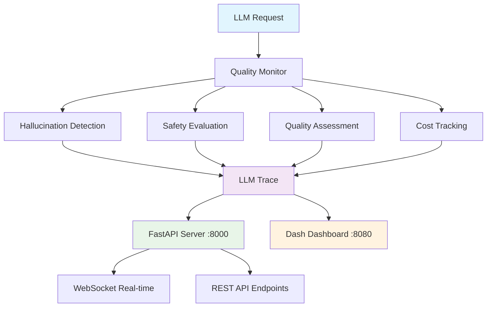

# LLM Quality & Safety Monitoring Framework

A production-ready containerized framework for monitoring LLM applications with focus on quality, safety, and cost optimization - not just system metrics.

## Architecture Overview

### **Request Flow Diagram**

```
┌─────────────────┐    ┌───────────────────────────────────────────────┐
│   User/Client   │    │            LLM Monitoring Framework            │
│                 │    │                                               │
│  ┌───────────┐  │    │  ┌─────────────────────────────────────────┐  │
│  │    LLM    │  │    │  │          Quality Monitor               │  │
│  │ Request   │──┼────┼─▶│                                         │  │
│  │           │  │    │  │  ┌─────────────┐  ┌─────────────────┐  │  │
│  └───────────┘  │    │  │  │Hallucination│  │  Safety         │  │  │
│                 │    │  │  │ Detection   │  │  Evaluation     │  │  │
└─────────────────┘    │  │  │             │  │  • Toxicity     │  │  │
                       │  │  │ • Patterns  │  │  • Bias         │  │  │
┌─────────────────┐    │  │  │ • Confidence│  │  • PII Leakage  │  │  │
│   Dashboard     │    │  │  └─────────────┘  └─────────────────┘  │  │
│   :8080         │    │  │                                         │  │
│                 │    │  │  ┌─────────────┐  ┌─────────────────┐  │  │
│ ┌─────────────┐ │    │  │  │  Quality    │  │  Cost Tracking  │  │  │
│ │ Real-time   │ │    │  │  │ Assessment  │  │                 │  │  │
│ │ Metrics     │◀┼────┼──┼─▶│             │  │ • Token Usage   │  │  │
│ │ • Quality   │ │    │  │  │ • Semantic  │  │ • Model Costs   │  │  │
│ │ • Safety    │ │    │  │  │ • Relevance │  │ • Optimization  │  │  │
│ │ • Cost      │ │    │  │  │ • Coherence │  │                 │  │  │
│ └─────────────┘ │    │  │  └─────────────┘  └─────────────────┘  │  │
│                 │    │  └─────────────────────────────────────────┘  │
└─────────────────┘    │                        │                      │
                       │                        ▼                      │
┌─────────────────┐    │  ┌─────────────────────────────────────────┐  │
│  External       │    │  │              LLM Trace                 │  │
│  Integration    │    │  │                                         │  │
│                 │    │  │ • Trace ID: abc123def456                │  │
│ ┌─────────────┐ │    │  │ • Quality Score: 0.87                  │  │
│ │   REST API  │◀┼────┼──┤ • Safety Flags: []                     │  │
│ │   :8000     │ │    │  │ • Cost: $0.000043                      │  │
│ │             │ │    │  │ • Response Time: 150ms                 │  │
│ │/monitor/    │ │    │  └─────────────────────────────────────────┘  │
│ │inference    │ │    │                        │                      │
│ └─────────────┘ │    │                        ▼                      │
│                 │    │  ┌─────────────────────────────────────────┐  │
└─────────────────┘    │  │           FastAPI Server :8000         │  │
                       │  │                                         │  │
                       │  │ • REST Endpoints                        │  │
                       │  │ • WebSocket Real-time                   │  │
                       │  │ • Health Checks                         │  │
                       │  │ • CORS Support                          │  │
                       │  └─────────────────────────────────────────┘  │
                       └───────────────────────────────────────────────┘

Data Flow:
1. LLM Request → Quality Monitor (comprehensive evaluation)
2. Quality Monitor → LLM Trace (structured results)
3. LLM Trace → FastAPI Server (API endpoints)
4. FastAPI Server → Dashboard (real-time updates)
5. FastAPI Server → External Integration (REST API)
```

### **Component Architecture**



## Core Features

### 🛡️ **Safety & Quality Monitoring**
- **Hallucination Detection**: Pattern-based detection with confidence scoring
- **Toxicity Filtering**: Keyword and pattern-based safety evaluation
- **Bias Detection**: Automated fairness assessment with configurable patterns
- **PII Protection**: Regex-based detection of sensitive data (SSN, email, etc.)

### 📊 **LLM-Specific Observability**
- **Complete Request Tracing**: Full lifecycle visibility with unique trace IDs
- **Quality Metrics**: Semantic similarity, factual accuracy, relevance, coherence
- **Cost Tracking**: Token usage, model costs, efficiency analysis
- **Real-time Monitoring**: WebSocket-based live updates

### 🚀 **Production Features**
- **Containerized Deployment**: Docker + Docker Compose ready
- **CI/CD Pipeline**: GitHub Actions with automated testing and image publishing
- **Health Checks**: Built-in monitoring and alerting
- **RESTful API**: Comprehensive endpoints for integration

## Quick Start

### 🐳 **Using Docker (Recommended)**

```bash
# Start full stack (API + Dashboard)
make up

# Or individually
make run-api    # API only on :8000
make run-dash   # Dashboard only on :8080

# Run tests in container
make test

# View logs
make logs
```

### 🐍 **Local Development**

```bash
# Install dependencies
pip install -r requirements.txt

# Start full stack
python main.py

# Or start services individually  
python main.py --api-only         # API server only
python main.py --dashboard-only   # Dashboard only
```

**Access Points:**
- **API Documentation**: http://localhost:8000/docs
- **Dashboard**: http://localhost:8080
- **Health Check**: http://localhost:8000/health

## API Usage

### **Monitor LLM Inference**

```python
import requests

response = requests.post("http://localhost:8000/monitor/inference", json={
    "prompt": "What is the capital of France?",
    "response": "The capital of France is Paris.",
    "model_name": "gpt-4",
    "check_hallucination": True,
    "check_toxicity": True,
    "check_bias": True,
    "check_pii": True
})

result = response.json()
print(f"Quality Score: {result['quality_score']}")
print(f"Safety Score: {result['safety_score']}")
print(f"Cost: ${result['cost_usd']}")
```

### **Programmatic Usage**

```python
from monitoring.quality import QualityMonitor
from monitoring.cost import CostTracker

# Initialize monitors
quality_monitor = QualityMonitor()
cost_tracker = CostTracker()

# Evaluate response
trace = quality_monitor.evaluate_response(
    prompt="Explain quantum computing",
    response="Quantum computing uses qubits...",
    model_name="claude-3"
)

# Access results
print(f"Overall Quality: {trace.quality_metrics.overall_quality}")
print(f"Safety Flags: {[flag.value for flag in trace.safety_assessment.flags]}")
print(f"Cost: ${trace.cost_metrics.cost_usd}")

# Track costs
cost_tracker.log_inference("gpt-4", prompt_tokens=100, completion_tokens=50)
analysis = cost_tracker.get_cost_analysis("24h")
```

## REST API Endpoints

| Endpoint | Method | Description |
|----------|--------|-------------|
| `/health` | GET | Service health status |
| `/monitor/inference` | POST | Monitor LLM inference request |
| `/metrics/quality` | GET | Quality metrics and trends |
| `/metrics/safety` | GET | Safety violations and patterns |
| `/metrics/cost` | GET | Cost analysis and optimization |
| `/feedback` | GET | User feedback summary |
| `/evaluate` | POST | Batch evaluation of responses |
| `/ws/metrics` | WebSocket | Real-time metrics stream |

## Core Components

### **Quality Monitoring** (`monitoring/quality.py`)
```python
class QualityMonitor:
    """Main LLM quality monitoring system"""
    - HallucinationDetector: Pattern-based hallucination detection
    - SafetyEvaluator: Multi-dimensional safety assessment  
    - QualityAssessor: Response quality scoring
```

### **Cost Tracking** (`monitoring/cost.py`)
```python
class CostTracker:
    """LLM cost monitoring and optimization"""
    - Real-time cost calculation per model
    - Usage analytics and projections
    - Budget alerts and optimization suggestions
```

### **Data Models** (`monitoring/models.py`)
```python
# Core data structures
- LLMTrace: Complete request/response trace
- QualityMetrics: Quality assessment scores
- SafetyAssessment: Safety evaluation results
- CostMetrics: Cost tracking data
- SafetyFlag: Enumerated safety violations
```

### **FastAPI Server** (`api/server.py`)
```python
# Production API server
- RESTful endpoints for monitoring
- WebSocket real-time updates
- CORS-enabled for dashboard integration
- Health checks and observability
```

### **Dash Dashboard** (`dashboard/app.py`)
```python
# Real-time monitoring dashboard
- Live quality and safety metrics
- Cost tracking visualizations
- Interactive charts and alerts
- Real-time updates via API polling
```

## Docker Configuration

### **Dockerfile**
- **Base**: Python 3.11-slim
- **Security**: Non-root user execution
- **Optimization**: Multi-stage build with caching
- **Health Checks**: Built-in container health monitoring

### **Docker Compose**
- **API Service**: Runs on port 8000 with hot-reload
- **Dashboard Service**: Runs on port 8080 with API dependency
- **Full Stack**: Combined service for production deployment
- **Development**: Volume mounting for live code updates

### **Makefile Commands**
```bash
make build      # Build Docker image
make test       # Run tests in container
make run        # Run full application
make run-api    # API server only
make run-dash   # Dashboard only
make up         # Start with docker-compose
make down       # Stop all services
make logs       # View container logs
make shell      # Access container shell
make clean      # Clean up Docker resources
```

## CI/CD Pipeline

### **GitHub Actions Workflow** (`.github/workflows/ci.yml`)

**Test Job:**
- Python 3.11 environment setup
- Dependency installation
- Pytest execution with coverage
- Component validation

**Docker Job:**
- Docker image build with BuildKit
- Container health testing
- GitHub Container Registry (GHCR) publishing
- Multi-platform image support

**Image Tags:**
- `latest` - Main branch latest
- `sha-<commit>` - Commit-specific builds
- `<branch-name>` - Feature branch builds

**Registry**: `ghcr.io/heyyymonth/llm-monitoring-framework`

## Configuration

### **Environment Variables**
```bash
PYTHONPATH=/app                    # Python module path
API_BASE_URL=http://localhost:8000 # Dashboard API connection
```

### **Model Configuration**
```python
# In monitoring/cost.py
MODEL_COSTS = {
    "gpt-4": {"prompt": 0.00003, "completion": 0.00006},
    "gpt-3.5-turbo": {"prompt": 0.000001, "completion": 0.000002},
    "claude-3": {"prompt": 0.000015, "completion": 0.000075}
}
```

## Testing

### **Run Tests**
```bash
# Docker-based testing
make test

# Local testing
make test-local
python -m pytest tests/ -v

# Specific test modules
python -m pytest tests/test_quality_monitoring.py -v
python -m pytest tests/test_integration_ollama.py -v
```

### **Test Coverage**
- Quality monitoring functionality
- Safety evaluation algorithms
- Cost tracking accuracy
- API endpoint validation
- Integration testing with Ollama

## Deployment

### **Production Deployment**
```bash
# Pull from registry
docker pull ghcr.io/heyyymonth/llm-monitoring-framework:latest

# Run production container
docker run -d \
  -p 8000:8000 \
  -p 8080:8080 \
  --name llm-monitor \
  ghcr.io/heyyymonth/llm-monitoring-framework:latest
```

### **Scaling with Docker Compose**
```yaml
version: '3.8'
services:
  llm-monitor:
    image: ghcr.io/heyyymonth/llm-monitoring-framework:latest
    ports:
      - "8000:8000"
      - "8080:8080"
    deploy:
      replicas: 3
      resources:
        limits:
          memory: 1G
        reservations:
          memory: 512M
```

## Monitoring Capabilities

### **Quality Metrics**
- **Semantic Similarity**: Prompt-response alignment scoring
- **Factual Accuracy**: Content verification and consistency
- **Response Relevance**: Topic and context relevance assessment
- **Coherence Score**: Language quality and structure analysis

### **Safety Flags**
- `HALLUCINATION`: Detected factual inconsistencies
- `TOXICITY`: Harmful or offensive content
- `BIAS`: Discriminatory or unfair language
- `PII_LEAK`: Personal identifiable information exposure
- `PROMPT_INJECTION`: Potential security vulnerabilities

### **Cost Optimization**
- Real-time cost tracking per model
- Token usage optimization suggestions
- Budget alerts and projections
- Model efficiency comparisons

## License

MIT License - See [LICENSE](LICENSE) file for details.

## Contributing

1. Fork the repository
2. Create feature branch: `git checkout -b feature/your-feature`
3. Make changes and test: `make test`
4. Commit changes: `git commit -m "feat: your feature"`
5. Push to branch: `git push origin feature/your-feature`
6. Create Pull Request

---

**Focus**: Production-ready LLM monitoring with quality, safety, and cost optimization.
